# MicroringLib

**MicroringLib** is a physics-first Python library for simulating integrated photonic microring resonators.

It is designed for fast, physically interpretable modeling of:

- straight waveguides
- single-bus microring resonators
- add-drop microring resonators
- cascaded rings
- WDM filter banks
- thermal tuning
- group delay / slow-light behavior
- fabrication Monte Carlo tolerance
- ring modulator eye diagrams
- reduced Kerr bistability
- reduced SFWM photon-pair scaling

The main design goal is simple:

> **Do not just generate spectra — enforce the physics.**

MicroringLib keeps field and power quantities separate, constructs couplers as unitary scattering elements, checks passive energy conservation, and reports physically meaningful resonance metrics such as FSR, FWHM, loaded \(Q\), finesse, extinction ratio, and group delay.

---

## Publication and Availability

MicroringLib is publicly available as both a GitHub repository and an installable PyPI package.

### GitHub

Source code, examples, tests, and documentation:

```text
https://github.com/ElbekJK/microringlib
```

### PyPI

Install directly with:

```bash
pip install microringlib
```

PyPI project page:

```text
https://pypi.org/project/microringlib/
```

---

## Installation

From PyPI:

```bash
pip install microringlib
```

For development:

```bash
git clone https://github.com/ElbekJK/microringlib.git
cd microringlib
pip install -e .
```

Run tests:

```bash
PYTHONPATH=$PWD python3 -m pytest
```

Current validation result:

```text
126 passed
```

---

## Quick Start

```python
import numpy as np
import microringlib as mrl

wl = np.linspace(1520e-9, 1580e-9, 20001)

layers = [
    mrl.Layer(material="SiO2 lower", thickness=2e-6, n=1.444, alpha=0),
    mrl.Layer(
        material="Si core",
        thickness=220e-9,
        n=3.476,
        alpha=mrl.Layer.dbcm_to_npm(3.0),
    ),
    mrl.Layer(material="SiO2 upper", thickness=2e-6, n=1.444, alpha=0),
]

ring = mrl.RingGeometry(radius=10e-6)

c1 = mrl.Coupler.from_power_coupling(0.12)
c2 = mrl.Coupler.from_power_coupling(0.12)

res = mrl.single_mrr_add_drop(
    wavelengths=wl,
    resonator=ring,
    layers=layers,
    t1=c1.t,
    kappa1=c1.kappa,
    t2=c2.t,
    kappa2=c2.kappa,
    polarization="TE",
    overlap_factors=[0.05, 0.90, 0.05],
)

thru = res.ports["through"]["power"]
drop = res.ports["drop"]["power"]

print(np.max(thru + drop))
```

Expected passive behavior:

```text
P_thru + P_drop <= 1
```

---

## Why Physics-First?

Many microring scripts can produce plausible spectra while still hiding physical issues such as:

- non-unitary couplers
- passive devices with output power greater than input power
- inconsistent field/power normalization
- fragile resonance detection
- thermal sweeps jumping between resonance orders
- misleading metric names such as treating notch depth as intracavity enhancement

MicroringLib avoids these problems by enforcing core constraints directly.

### Coupler Unitarity

For a lossless coupler:

$$
|t|^2 + |\kappa|^2 = 1
$$

MicroringLib constructs couplers from the power coupling coefficient:

$$
K = |\kappa|^2
$$

```python
c = mrl.Coupler.from_power_coupling(0.12)

print(abs(c.t)**2)
print(abs(c.kappa)**2)
print(abs(c.t)**2 + abs(c.kappa)**2)
```

Example output:

```text
|t|^2 = 0.880000
|kappa|^2 = 0.120000
|t|^2 + |kappa|^2 = 1.000000
```

### Passive Add-Drop Conservation

For passive add-drop rings:

$$
P_{\mathrm{thru}}(\lambda) + P_{\mathrm{drop}}(\lambda) \le 1
$$

Example result:

```text
max(P_thru + P_drop) = 0.99987534
min(P_thru + P_drop) = 0.97031454
Passes passive constraint: True
```

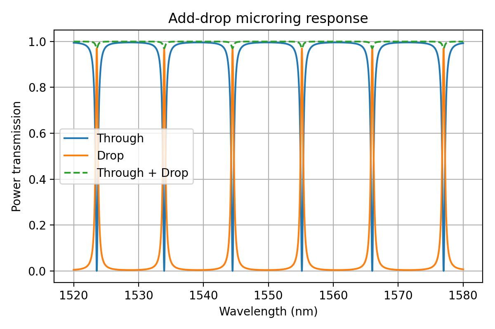

---

## Main Features

| Feature | Description |
|---|---|
| `Layer` | Optical layer with refractive index, loss, thermo-optic coefficient, or material backend |
| `RingGeometry` | Circular ring geometry |
| `Coupler` | Unitary coupler construction from power coupling |
| `single_mrr_thru` | Single-bus through-port microring |
| `single_mrr_add_drop` | Add-drop microring with named ports |
| `cascaded_mrrs_add_drop` | Cascaded microring models |
| `compute_resonance_metrics` | FSR, FWHM, loaded \(Q\), finesse, extinction ratio |
| `compute_group_delay` | Phase-derived group delay |
| `track_resonance_vs_parameter` | Resonance-order tracking during sweeps |
| `materials.py` | Constant, tabulated, function, refractive-index style material backends |
| `fast.py` | Accelerated reduced models for high-volume sweeps |
| `nonlinear.py` | Reduced Kerr bistability models |
| `quantum.py` | Reduced SFWM photon-pair scaling tools |

---

## Resonance Metrics

MicroringLib extracts physically meaningful quantities:

$$
Q_{\mathrm{loaded}} = \frac{\lambda_0}{\Delta \lambda_{\mathrm{FWHM}}}
$$

$$
\mathcal{F} = \frac{\mathrm{FSR}}{\Delta \lambda_{\mathrm{FWHM}}}
$$

Example output:

```text
resonance_wavelength: 1523.558000 nm
fwhm: 0.424834 nm
fsr: 10.683000 nm
loaded_Q: 3586.239
finesse: 25.146
extinction_ratio_db: 36.403 dB
num_resonances_detected: 6
```

MicroringLib reports `notch_depth_factor` rather than incorrectly treating inverse notch transmission as true intracavity intensity enhancement.

---

## Critical Coupling and Loaded Q

The coupling coefficient \(K = |\kappa|^2\) controls the resonance linewidth and extinction.

As coupling increases:

$$
K \uparrow
\quad \Rightarrow \quad
\Delta \lambda_{\mathrm{FWHM}} \uparrow
$$

$$
K \uparrow
\quad \Rightarrow \quad
Q_{\mathrm{loaded}} \downarrow
$$

Example tracked resonance sweep:

```text
K = 0.005 -> Loaded Q ≈ 92108
K = 0.080 -> Loaded Q ≈ 10028
```

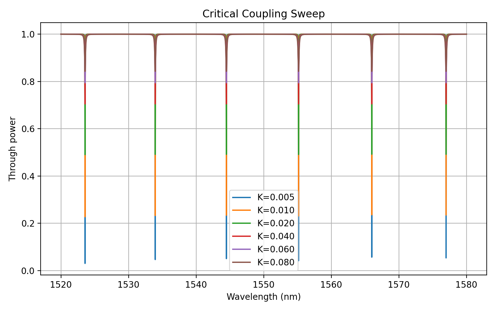

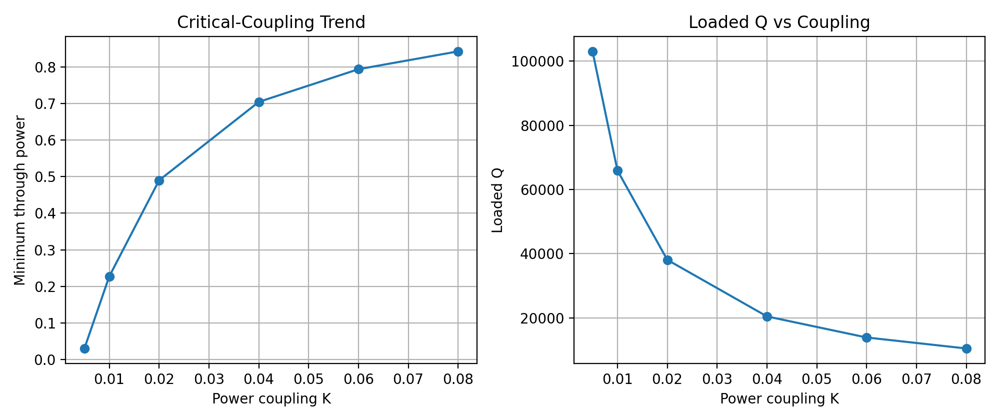

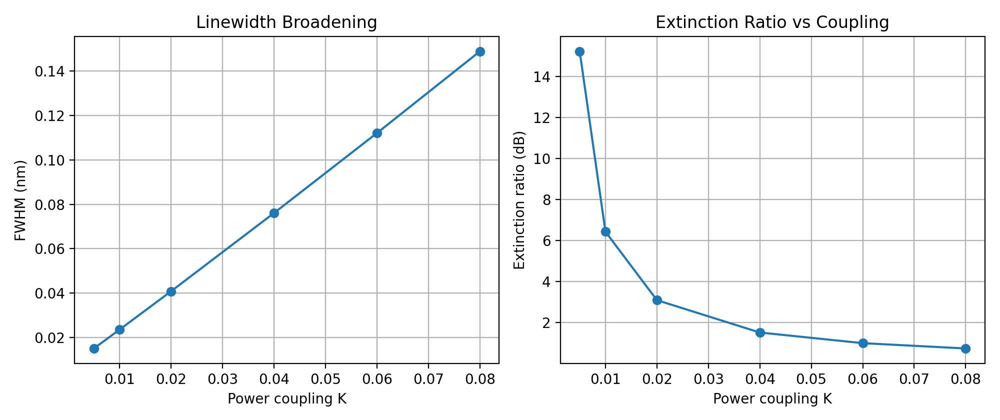

---

## Thermal Tuning

MicroringLib supports thermo-optic tuning through:

$$
n(T) = n_0 + \frac{dn}{dT}(T - T_0)
$$

Example tracked resonance shift:

```text
T = 20 C -> resonance = 1554.755 nm
T = 40 C -> resonance = 1556.363 nm
Approx tracked tuning slope = 0.0804 nm/C
```

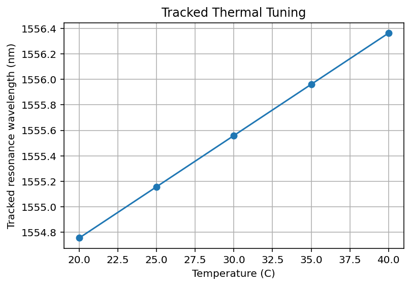

This demonstrates a physically realistic positive thermo-optic redshift for a silicon-dominated mode.

---

## Group Delay and Slow Light

The group delay is computed from the field phase:

$$
\tau_g = -\frac{d\phi}{d\omega}
$$

Example result:

```text
Minimum delay: 0.019731 ps
Maximum delay: 28.514953 ps
Mean delay:    0.799897 ps
Delay peak offset from resonance: 0.000000 nm
```

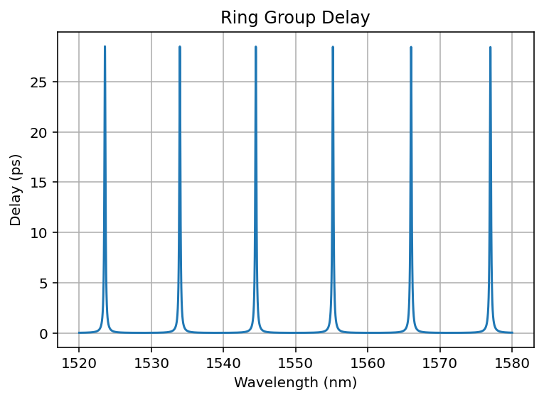

---

## Cascaded Rings and Vernier-Like Effects

Multiple rings with different radii create interleaved resonances and effective spectral spacing different from individual ring FSRs.

Example result:

```text
Ring 1 FSR estimate = 9.104 nm
Ring 2 FSR estimate = 8.926 nm
Ring 3 FSR estimate = 8.754 nm

Combined effective spacing ≈ 3.336 nm
Passive cascade check: True
```

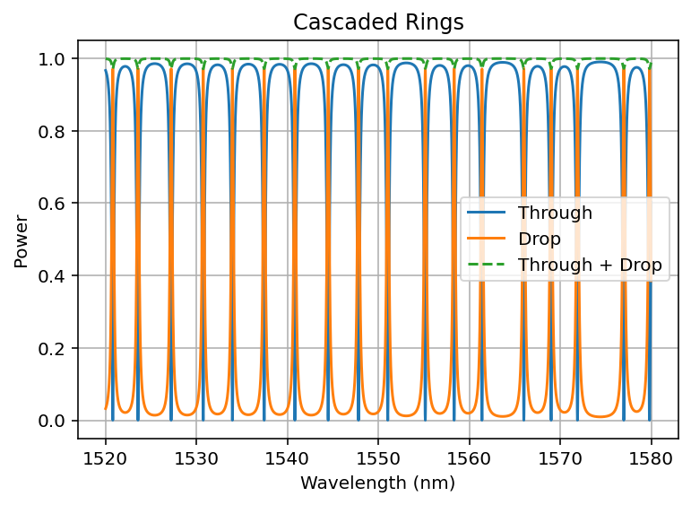

---

## WDM 8-Channel Filter Bank

MicroringLib can model WDM filter banks by sweeping ring radii.

Example extracted channel centers:

```text
CH1: 1543.8159 nm
CH2: 1545.5635 nm
CH3: 1547.2796 nm
CH4: 1548.9657 nm
CH5: 1550.6218 nm
CH6: 1552.2479 nm
CH7: 1553.8469 nm
CH8: 1555.4175 nm
```

Channel spacing:

```text
Mean spacing: 1.6574 nm
Std spacing:  0.0589 nm
Min spacing:  1.5706 nm
Max spacing:  1.7476 nm
```

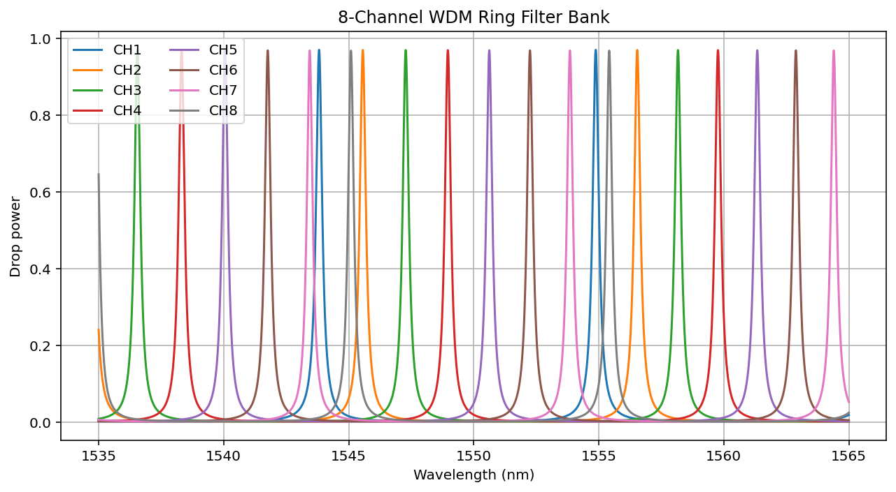

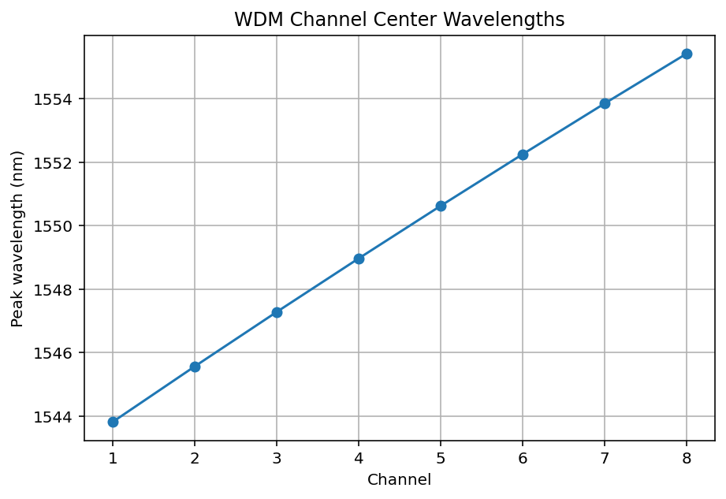

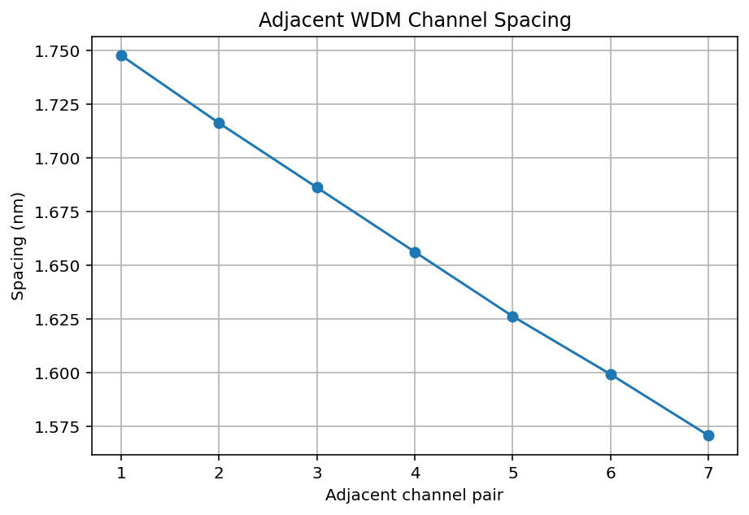

---

## Fabrication Monte Carlo Tolerance

The accelerated utilities can run large Monte Carlo tolerance studies.

Example perturbations:

$$
R \rightarrow R + \delta R
$$

$$
n_{\mathrm{Si}} \rightarrow n_{\mathrm{Si}} + \delta n
$$

Fast vectorized example:

```text
Trials: 100000
sigma_R = 5 nm
sigma_n = 1e-4

Resonance mean: 1548.9991 nm
Resonance std:  0.7027 nm
Q mean: 58843.69
Q std:  2408.40
ER mean: 4.55 dB
ER std:  1.53 dB
```

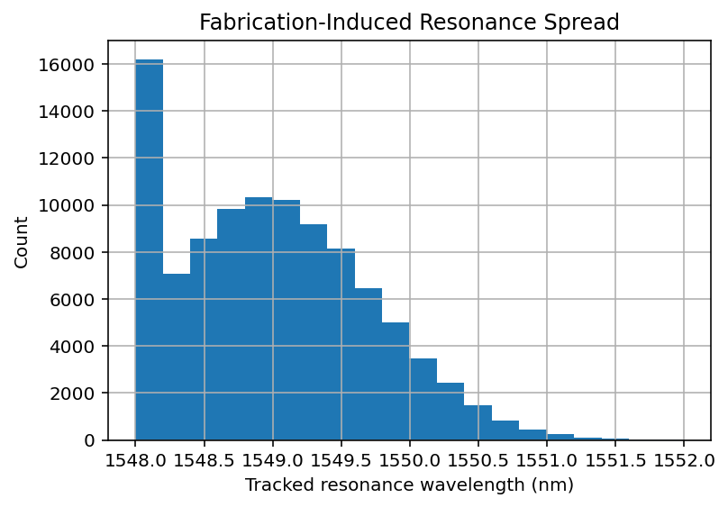

---

## Ring Modulator Eye Diagram

A ring modulator shifts the resonance relative to a fixed laser:

$$
\Delta n_{\mathrm{eff}}
\rightarrow
\Delta \lambda_{\mathrm{res}}
\rightarrow
\Delta P_{\mathrm{thru}}
$$

Example result:

```text
Resonance wavelength: 1555.157839 nm
Laser wavelength:    1555.168479 nm
Off-state transmission: 0.69021948
On-state transmission:  0.99998284
OMA: 0.30976336
Extinction ratio: 1.610 dB
Bitrate: 25.00 Gb/s
Electrical bandwidth: 18.00 GHz
```

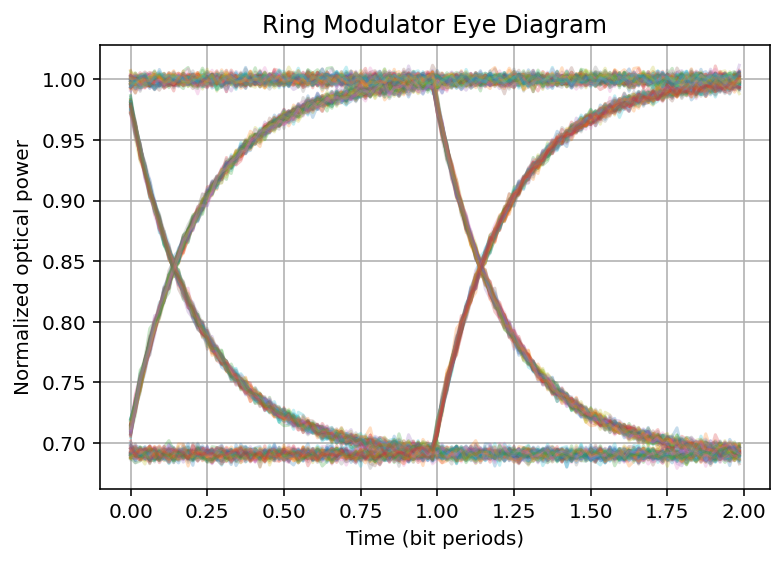

---

## Kerr Nonlinear Bistability

MicroringLib includes reduced single-mode Kerr cavity tools.

The reduced steady-state model is:

$$
U =
\frac{\kappa_{\mathrm{ex}}P_{\mathrm{in}}}
{(\kappa/2)^2 + (\Delta - gU)^2}
$$

The physically useful S-curve is obtained from the equivalent cubic steady-state relation.

Updated reduced-model result:

```text
Input power range: 0 to 80 mW
kappa_ex / 2pi: 40 GHz
kappa_0 / 2pi: 20 GHz
kappa / 2pi: 60 GHz
detuning / kappa: 3.000

Lower switching power: 0.635045 mW
Upper switching power: 3.628624 mW
Max Kerr shift / kappa: 6.706570
Max hysteresis transmission difference: 0.817178
Largest hysteresis near Pin = 0.701 mW
T_up there:   0.974432
T_down there: 0.157255
```

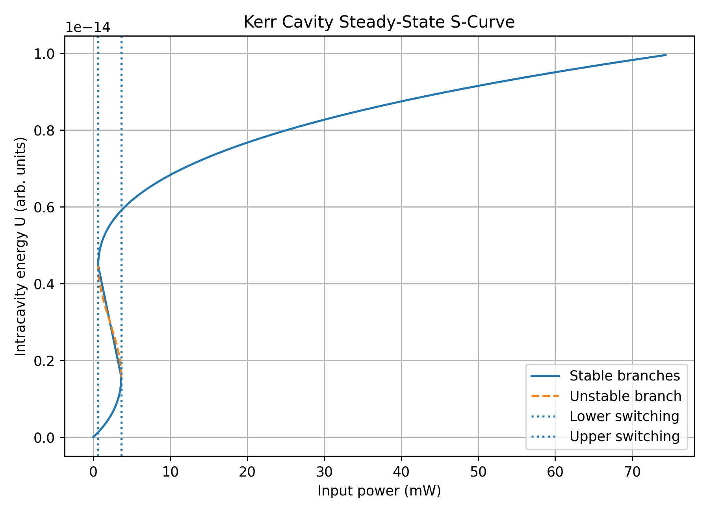

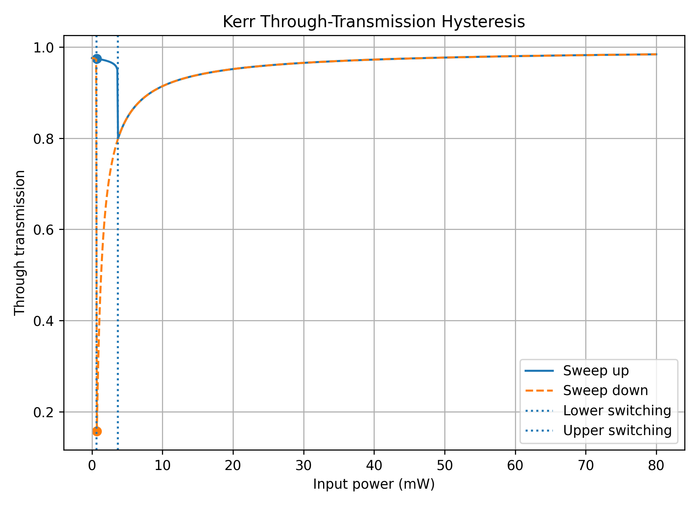

The bistable region lies between approximately \(0.635\) mW and \(3.629\) mW. Within this window, the same input power can support different stable intracavity states depending on sweep direction.

This is a reduced steady-state model, not a full Lugiato-Lefever equation solver.

---

## SiC SFWM Photon-Pair Scaling

MicroringLib includes reduced spontaneous four-wave mixing scaling tools.

A simplified relative trend is:

$$
R_{\mathrm{pair}}
\propto
\gamma^2 P_p^2 \frac{Q^3}{R^2}
$$

Example SiC add-drop ring result:

```text
Tracked pump resonance: 1552.8770 nm
Loaded Q: 19354.21
Ring radius: 25.00 um
Relative pair rate at 20 mW: 1.000

n_eff approximation: 2.6000
Propagation loss: 1.000 dB/cm
K1: 0.0400
K2: 0.0400
Detected resonances: 10
FWHM: 0.080235 nm
FSR: 5.904000 nm
Finesse: 73.584
Drop ER: 33.421 dB
Max P_through + P_drop: 0.99996309
Passive check: True
```

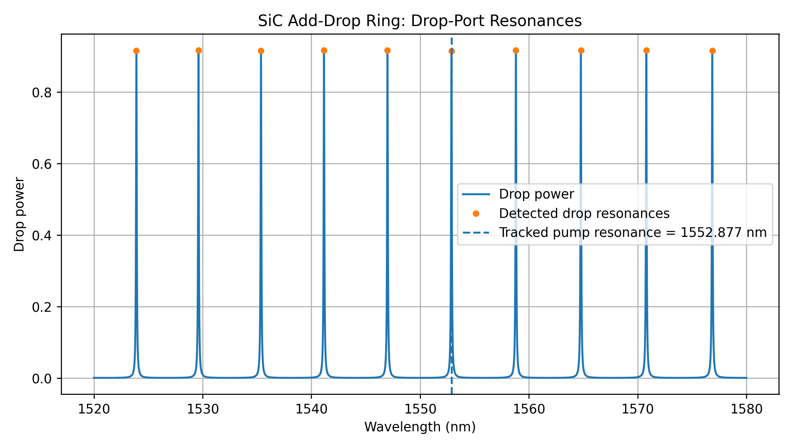

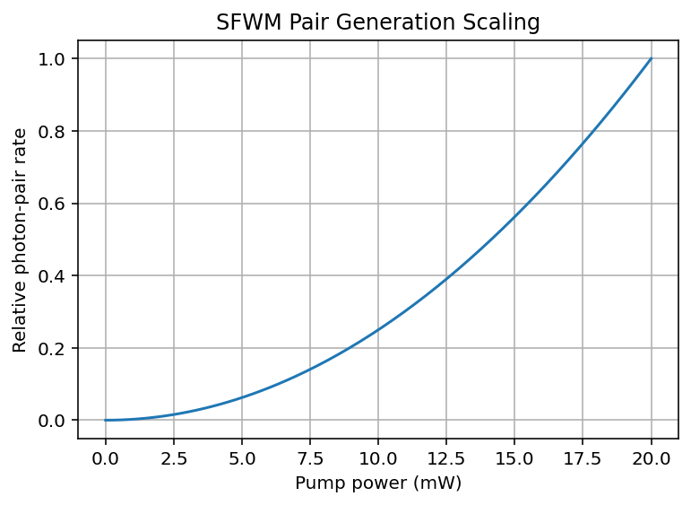

This is a relative pair-rate model, not an absolute calibrated quantum-source simulator.

---

## Accelerated Models

The `fast.py` module provides analytical reduced models for high-volume sweeps:

```python
import numpy as np
import microringlib as mrl

wl = np.linspace(1540e-9, 1560e-9, 1001)

fields, powers, t, kappa = mrl.single_mrr_thru_fast_batch(
    wavelengths=wl,
    radius=10e-6,
    n_eff=3.476,
    alpha_dbcm=2.0,
    K_values=[0.01, 0.02, 0.04],
)
```

Available accelerated helpers include:

```python
mrl.single_mrr_thru_fast
mrl.single_mrr_thru_fast_batch
mrl.single_mrr_add_drop_fast
mrl.compute_resonance_metrics_fast
mrl.compute_peak_metrics_fast
mrl.monte_carlo_ring_tolerance_fast
mrl.monte_carlo_resonance_formula_fast
mrl.sfwm_pair_rate_relative_fast
```

These functions are ideal for:

- Monte Carlo studies
- WDM sweeps
- figure generation
- reduced SFWM scaling
- rapid design-space exploration

They are not replacements for the full physics-first transfer functions when detailed layer modeling is required.

---

## Material Backends

MicroringLib supports several material styles:

```python
mrl.ConstantMaterial(...)
mrl.TabulatedMaterial(...)
mrl.FunctionMaterial(...)
mrl.RefractiveIndexInfoMaterial(...)
mrl.PyOptikMaterial(...)
```

Complex refractive index:

$$
\tilde{n}(\lambda,T) = n(\lambda,T) + ik(\lambda,T)
$$

Material absorption:

$$
\alpha_{\mathrm{power}}(\lambda) = \frac{4\pi k(\lambda)}{\lambda}
$$

This allows simulations to include wavelength-dependent dispersion and absorption.

---

## Comparison with Existing Photonics Tools

MicroringLib is not designed to replace full-wave solvers or layout tools. It fills a lightweight, physically interpretable microring-focused role.

| Tool | Main strength | Typical role | Relation to MicroringLib |
|---|---|---|---|
| gdsfactory | Layout and PDK workflow | Parametric photonic layout and tapeout workflows | Complementary: layout-first |
| Meep | Open-source FDTD | Full-wave electromagnetic simulation | Higher fidelity, heavier compute |
| Tidy3D | Python FDTD workflow | Programmatic FDTD and post-processing | Higher fidelity, commercial/cloud workflow |
| SAX / Simphony | S-parameter circuits | Photonic circuit simulation and optimization | More general circuit-level framework |
| MicroringLib | Physics-first ring modeling | Fast spectra, metrics, WDM, thermal, Monte Carlo, demos | Ring-focused and interpretable |

MicroringLib is best viewed as a bridge between analytic microring theory and large simulation frameworks.

---

## Example Scripts

The repository includes examples such as:

```text
examples/demo1_add_drop_validation.py
examples/demo2_critical_coupling_metrics.py
examples/demo3_thermal_tuning.py
examples/demo4_cascaded_rings.py
examples/demo_group_delay.py
examples/demo_wdm_8ch_filter_bank_with_spacing.py
examples/demo_ring_modulator_eye.py
examples/demo_kerr_bistability_integrated.py
examples/demo_sic_sfwm_photon_pairs.py
examples/demo_monte_carlo_tolerance.py
examples/demo_ai_inverse_design_random.py
```

Run from the repository root:

```bash
PYTHONPATH=$PWD python3 examples/demo2_critical_coupling_metrics.py
```

---

## API Overview

### Core classes

```python
mrl.Layer
mrl.RingGeometry
mrl.Coupler
mrl.TransmissionResult
```

### Transfer models

```python
mrl.straight_waveguide
mrl.single_mrr_thru
mrl.single_mrr_add_drop
mrl.cascaded_mrrs_add_drop
```

### Metrics

```python
mrl.compute_resonance_metrics
mrl.compute_group_delay
mrl.find_resonances
mrl.fit_lorentzian
mrl.track_resonance_vs_parameter
```

### Fast models

```python
mrl.single_mrr_thru_fast
mrl.single_mrr_thru_fast_batch
mrl.single_mrr_add_drop_fast
mrl.compute_resonance_metrics_fast
mrl.compute_peak_metrics_fast
mrl.monte_carlo_ring_tolerance_fast
mrl.sfwm_pair_rate_relative_fast
```

### Nonlinear

```python
mrl.KerrCavityParams
mrl.kerr_hysteresis
mrl.kerr_through_power
mrl.kerr_params_from_Q
```

### Quantum

```python
mrl.SFWMParams
mrl.sfwm_pair_rate_relative
mrl.sfwm_joint_spectral_amplitude_toy
mrl.heralded_purity_from_jsa
mrl.brightness_summary
```

---

## Validation

The current release passes:

```text
126 passed
```

Test categories include:

- core models
- transfer functions
- material backends
- resonance metrics
- plotting smoke tests
- fast accelerated utilities
- public API consistency
- publishability checks

Run:

```bash
PYTHONPATH=$PWD python3 -m pytest
```

---

## Limitations

MicroringLib is intentionally lightweight and physically interpretable. Current limitations include:

- scalar effective-index approximation in reduced/fast models
- no built-in full-vector eigenmode solver
- coupling coefficients are user-specified rather than geometry-derived
- nonlinear and quantum modules are reduced models
- no calibrated full Lugiato-Lefever comb solver yet
- material database wrappers depend on optional external packages

For high-fidelity electromagnetic design, use MicroringLib alongside tools such as Meep, Tidy3D, Lumerical, gdsfactory, SAX, or Simphony.

---

## Roadmap

Planned improvements:

- geometry-to-coupling calibration
- optional mode-solver integration
- improved material database support
- full documentation site
- benchmark suite
- gdsfactory/SAX interoperability
- calibrated nonlinear and thermal modules
- improved inverse-design examples
- full LLE-style comb solver

---

## Citation

If you use MicroringLib in research, please cite the repository:

```bibtex
@software{keskinoglu_microringlib_2026,
  author = {Keskinoglu, Elbek J.},
  title = {MicroringLib: A Physics-First Python Library for Integrated Microring Photonics},
  year = {2026},
  url = {https://github.com/ElbekJK/microringlib}
}
```

---

## Selected Theory References

- A. Yariv, “Universal relations for coupling of optical power between microresonators and dielectric waveguides,” *Electronics Letters*, 2000.
- B. E. Little et al., “Microring resonator channel dropping filters,” *Journal of Lightwave Technology*, 1997.
- W. Bogaerts et al., “Silicon microring resonators,” *Laser & Photonics Reviews*, 2012.
- H. A. Haus, *Waves and Fields in Optoelectronics*, Prentice Hall.
- G. P. Agrawal, *Nonlinear Fiber Optics*, Academic Press.
- L. G. Helt, M. Liscidini, and J. E. Sipe, “How does it scale? Comparing quantum and classical nonlinear optical processes in integrated devices,” *JOSA B*, 2012.
- A. F. Oskooi et al., “Meep: A flexible free-software package for electromagnetic simulations by the FDTD method,” *Computer Physics Communications*, 2010.

---

## License

MIT License.

---

## Author

**Elbek J. Keskinoglu**  
Email: `ejkeskinoglu@connect.ust.hk`

Repository:

```text
https://github.com/ElbekJK/microringlib
```

PyPI:

```text
https://pypi.org/project/microringlib/
```
