# microringlib

<p align="center">
  <b>Physics-first microring resonator simulation tools for integrated photonics.</b>
</p>

<p align="center">
  <a href="https://pypi.org/project/microringlib/"></a>
  <a href="https://pypi.org/project/microringlib/"></a>
  <a href="LICENSE"></a>
</p>

`microringlib` is a lightweight Python library for simulating microring resonators and related integrated-photonic circuits. It is designed to keep the physics visible: material indices, guided-mode quantities, coupling/loss, round-trip phase, resonator spectra, and system-level metrics are all represented explicitly.

The library is general and can be used with different photonic materials. The included publication demos focus on two platforms:

- **silicon photonics** as a baseline validation and teaching platform;
- **4H-SiC microring photonics** for resonance metrology, thermo-optic tuning, nonlinear optics, WDM filtering, quantum-link proxies, and FDTD handoff checks.

---

## What the library can model

| Area | What is included |
| --- | --- |
| Compact microring models | all-pass rings, add-drop rings, cascaded resonators, WDM banks |
| Transfer/scattering matrices | waveguides, couplers, phase shifters, MZIs, rings, Fabry-Perot cavities |
| Metrics | resonance search, linewidth, loaded Q, FSR, group delay, extinction ratio |
| Materials | constant, tabulated, functional, `refractiveindex`, and `PyOptik` material adapters |
| Optional FDE hooks | `modesolverpy`-based effective-index and group-index workflows |
| Optional FDTD hooks | MEEP/PyMEEP validation and calibration examples |
| Nonlinear / quantum demos | SHG proxies, SFWM toy models, pair-rate and CAR-style link budgets |

---

## Installation

### From PyPI

```bash
python -m pip install microringlib
```

### From source

```bash
git clone https://github.com/ElbekJK/microringlib.git
cd microringlib

python -m venv .venv
source .venv/bin/activate

python -m pip install --upgrade pip
python -m pip install -e ".[dev]"
pytest -q
```

### Optional solver/material backends

```bash
python -m pip install -e ".[materials,fde,accel,publication]"
```

MEEP/PyMEEP is usually installed with conda-forge:

```bash
conda install -c conda-forge pymeep
```

---

## Quick start

```python
import numpy as np
import microringlib as mrl

wl = np.linspace(1520e-9, 1580e-9, 2001)

layers = [
    mrl.Layer(material="Si core", thickness=220e-9, n=3.476, alpha=0.0),
    mrl.Layer(material="SiO2 cladding", thickness=2.0e-6, n=1.444, alpha=0.0),
]

ring = mrl.RingGeometry(radius=10e-6)
coupler = mrl.Coupler.from_power_coupling(0.08)

res = mrl.single_mrr_thru(
    wavelengths=wl,
    resonator=ring,
    layers=layers,
    t=coupler.t,
    kappa=coupler.kappa,
)

print("minimum through power:", res.power.min())
print("maximum through power:", res.power.max())
```

---

## Transfer/scattering matrix example

```python
import numpy as np
from microringlib import tmm

wl = np.linspace(1520e-9, 1580e-9, 2001)
neff = 2.42
alpha = tmm.dbcm_to_npm(2.0)

ring = tmm.ring_allpass_smatrix(
    wavelengths=wl,
    neff=neff,
    radius=10e-6,
    K=0.1,
    alpha_power=alpha,
)

assert ring.is_passive()
```

---

## Figure gallery

The images below are generated by the publication demo suite. They are included here to make the repository immediately readable before rerunning the full suite.

### Material data and FDE mode solving

| Material dispersion | FDE effective/group index |
| --- | --- |
| 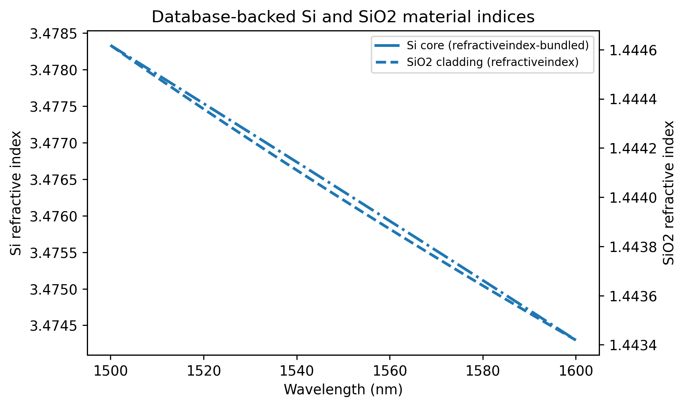 | 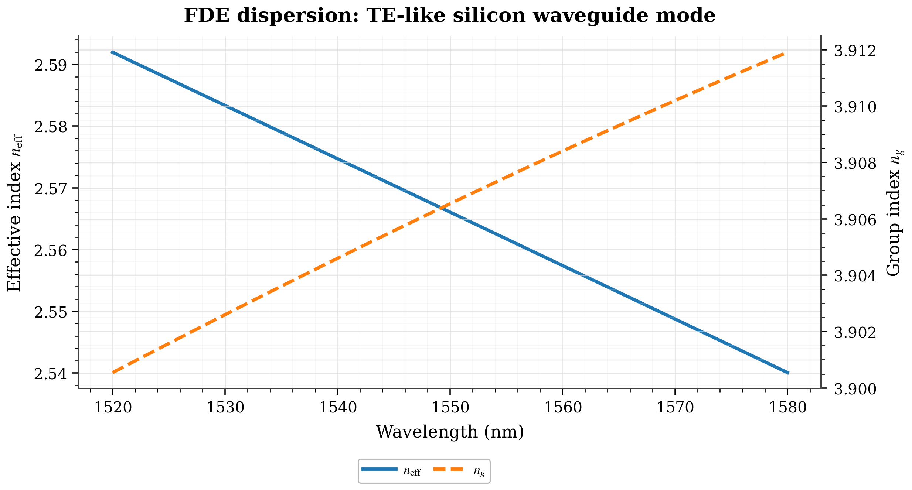 |

| FDE modal intensity |
| --- |
| 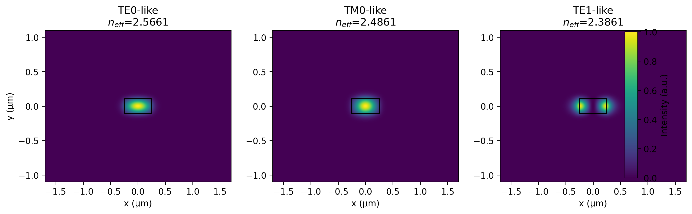 |

These figures demonstrate the first stage of the workflow: start from material optical constants, then solve for guided-mode quantities such as effective index and group index.

### Compact microring spectra and critical coupling

| Add-drop spectrum | Critical-coupling sweep |
| --- | --- |
| 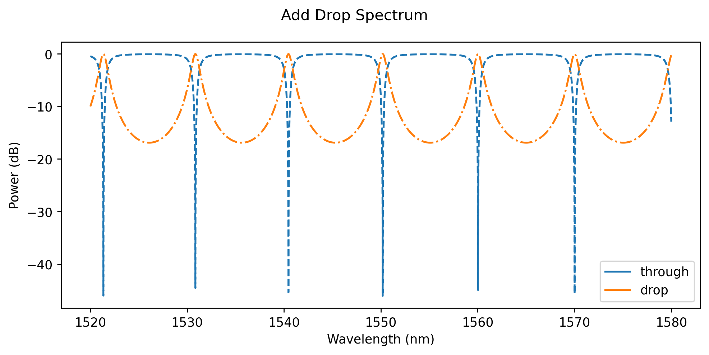 | 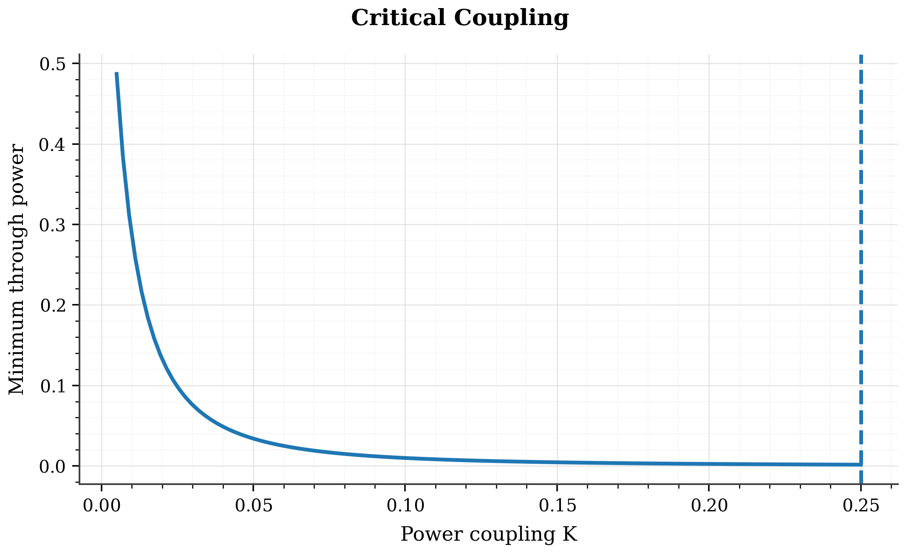 |

The add-drop spectrum shows periodic through-port notches and drop-port peaks caused by round-trip phase matching. The coupling sweep shows how extinction changes as the model approaches the coupling/loss balance.

### TMM and FDTD validation hooks

| TMM power budget | MEEP/FDTD validation hook |
| --- | --- |
| 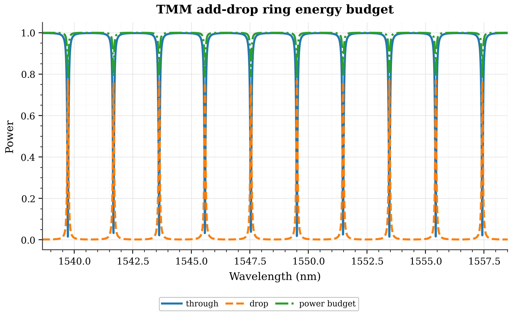 | 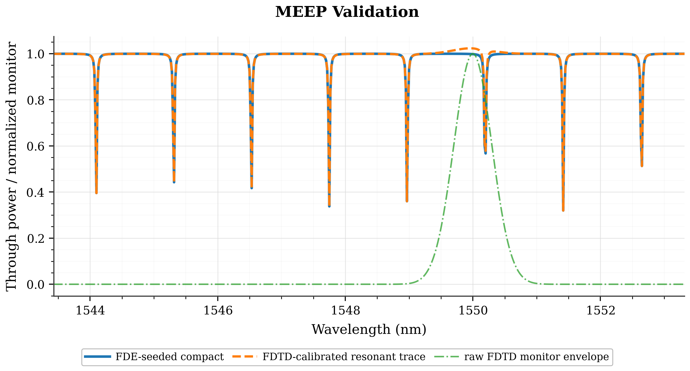 |

The TMM plot checks passive energy consistency in a compact circuit model. The MEEP/FDTD plot separates raw monitor behavior from calibrated resonant-trace comparison.

### 4H-SiC resonance metrology and thermal tuning

| Resonance metrology | Thermal spectra map |
| --- | --- |
| 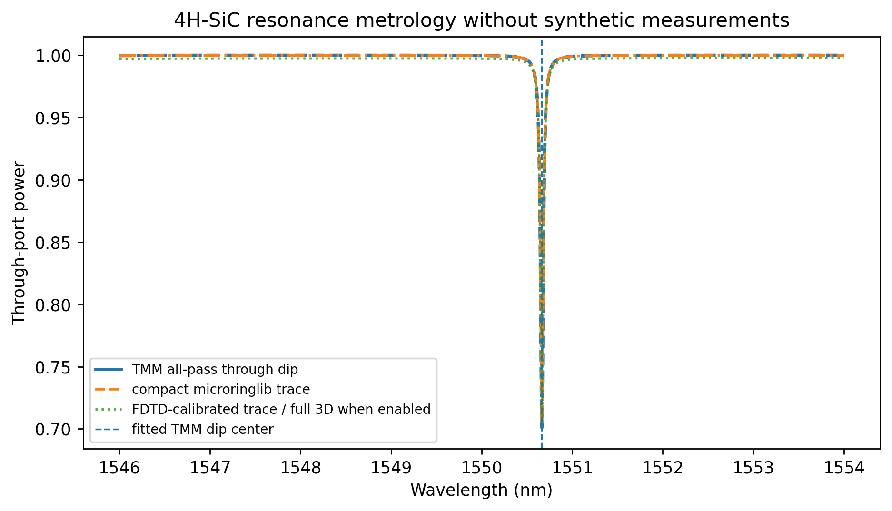 | 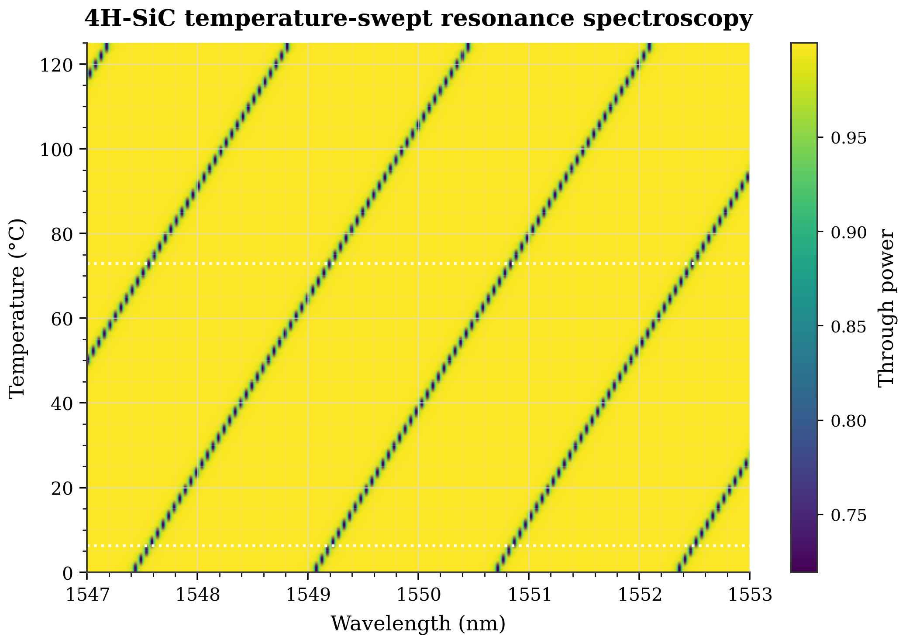 |

| Thermal resonance shift |
| --- |
| 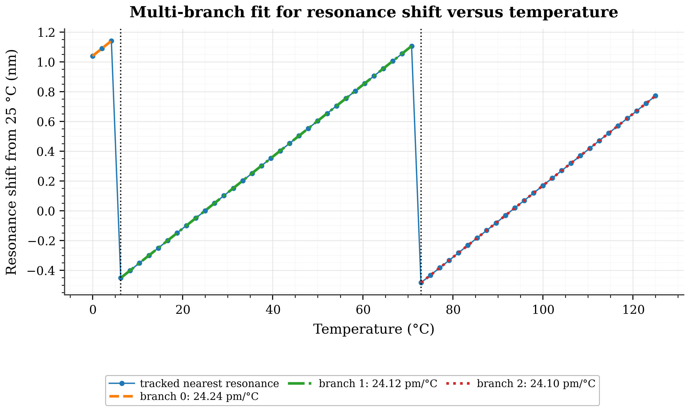 |

These 4H-SiC demos connect material/FDE assumptions to a compact resonator spectrum, then extract linewidth, loaded-Q proxy, and thermo-optic resonance shift.

### 4H-SiC nonlinear and quantum-link demos

| SHG phase-matching proxy | SHG power scaling |
| --- | --- |
| 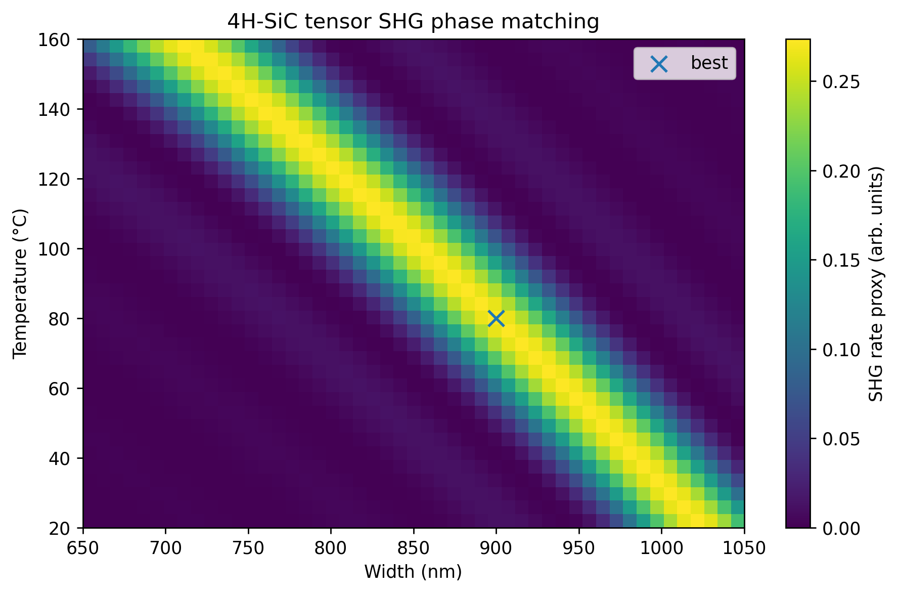 | 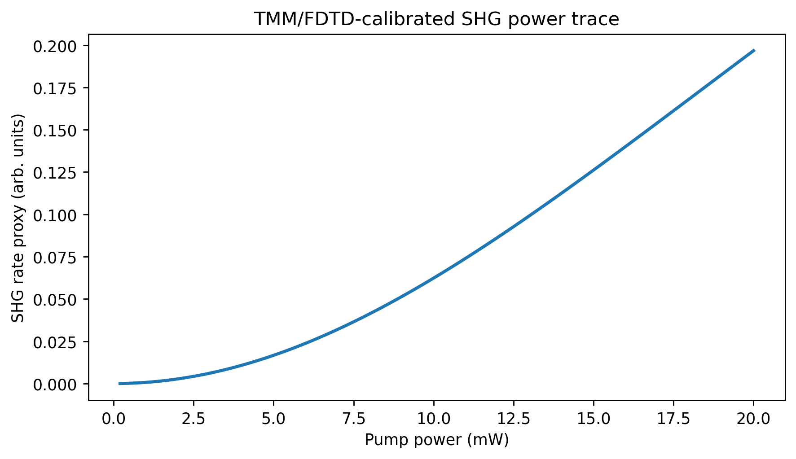 |

| WDM filter bank | Crosstalk matrix |
| --- | --- |
| 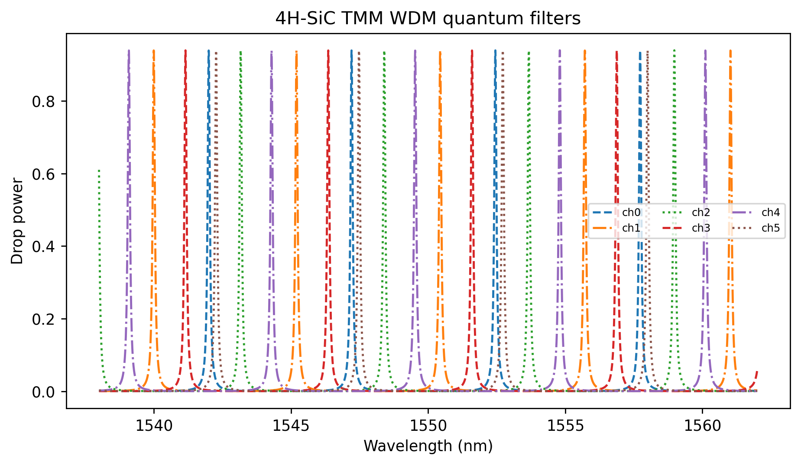 | 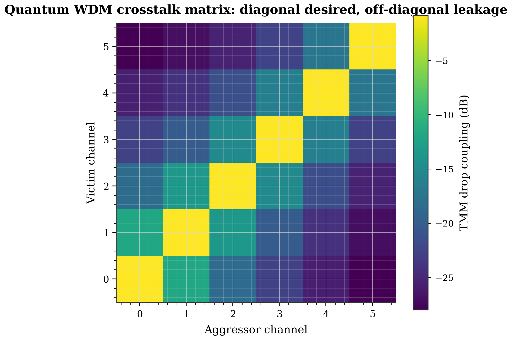 |

| CAR by channel | Full-radius 3D FDTD handoff |
| --- | --- |
| 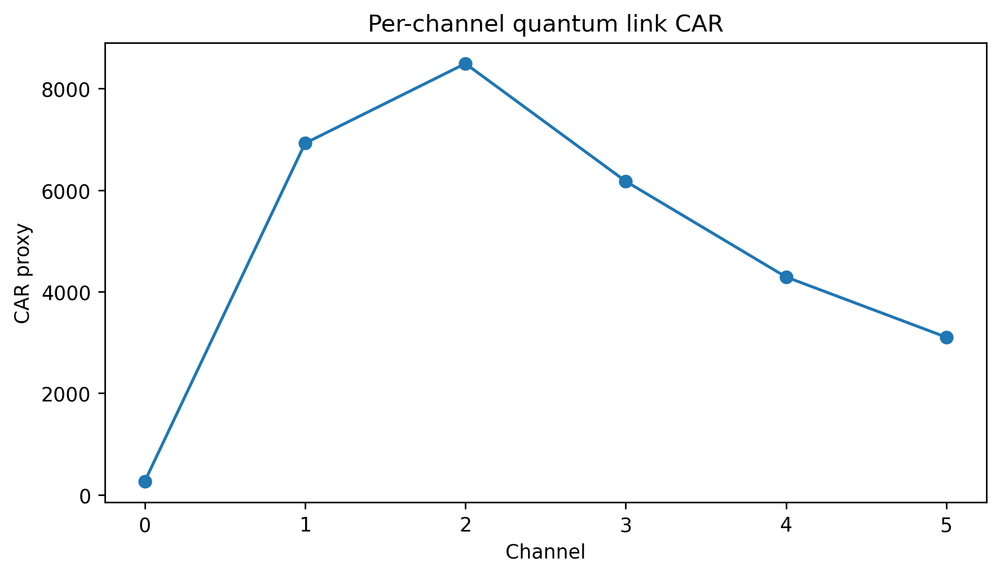 | 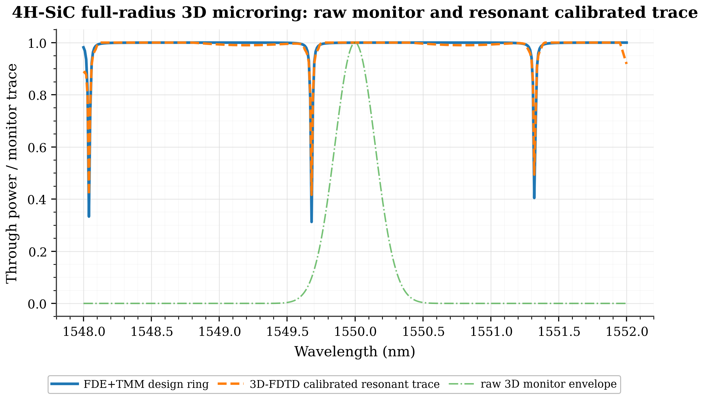 |

These plots are deliberately labeled as proxies or handoff checks where appropriate. The SHG maps are normalized phase-matching/cavity-enhancement proxies. The CAR plot is a channel-level link-budget proxy. The full-radius FDTD trace checks the field-simulation handoff path.

### Process-corner screening

| Process-corner spectra | Loaded-Q proxy by corner |
| --- | --- |
| 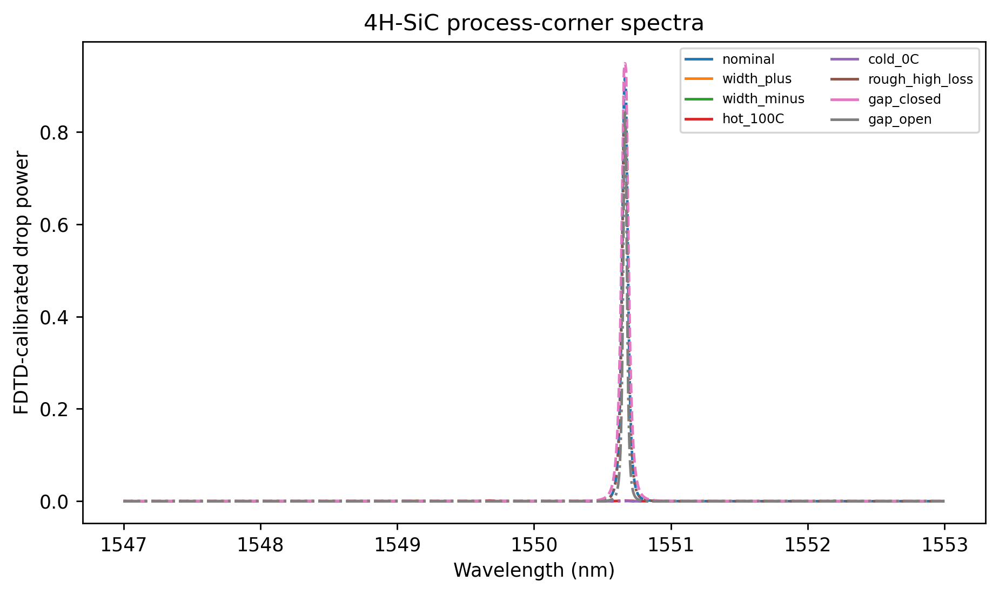 | 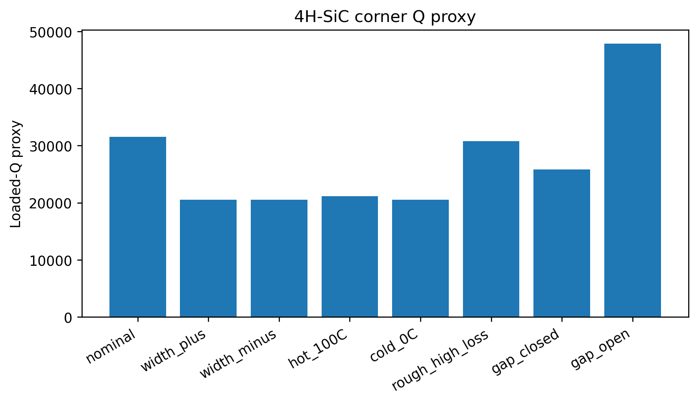 |

Process-corner demos perturb geometry, temperature, loss, and coupling assumptions to identify design sensitivity before fabrication or dense 3D simulation.

---

## Publication demo suite

The publication demos live in `examples_publication/`.

```bash
python examples_publication/run_publication_suite.py --clean --include-supplement
```

Generated artifacts are written to:

```text
examples_publication/publication_outputs/
examples_publication/publication_logs/
```

These generated folders are intentionally ignored by Git so that the repository stays lightweight.

### Demo map

| Demo | Topic | Main output / interpretation |
| --- | --- | --- |
| `demo_00` | Material indices and structure | material-database / reference-index consistency checks |
| `demo_01` | FDE modes | effective index, group index, and wavelength dispersion |
| `demo_02` | Add-drop spectrum | through/drop response and critical-coupling trend |
| `demo_03` | WDM from modes | channelized drop-bank response |
| `demo_04` | Vernier filters | resonance-envelope and channel-selection behavior |
| `demo_05` | Ring modulator | drive waveform, eye diagram, and transfer curve |
| `demo_06` | Kerr bistability | nonlinear intracavity response and transfer curve |
| `demo_07` | SiC tensor nonlinear optics | phase matching and tensor-channel trends |
| `demo_08` | Monte Carlo tolerance | yield and trimming statistics |
| `demo_09` | PBS inverse-design toy model | geometry/design-space tradeoff |
| `demo_10` | MEEP/FDTD validation hook | raw FDTD monitor and calibrated resonant trace |
| `demo_11` | Geometry comparison | radius/width effects on FSR and group index |
| `demo_12` | System matrix | loaded Q, radius, coupling, and pass-rate maps |
| `demo_13` | Experimental verification campaign scaffold | material/FDE/measurement comparison reports |
| `demo_14` | Mode-profile figure | normalized FDE mode intensity |
| `demo_15`--`demo_18` | SHG, pair generation, phase matching, WDM | nonlinear and quantum-link precursors |
| `demo_19`--`demo_21` | trimming, process corners, TMM layer | circuit-level and robustness checks |
| `demo_22`--`demo_27` | 4H-SiC focused demos | resonance metrology, thermal sweep, SHG, WDM/CAR, process corners, 3D FDTD handoff |

---

## Repository structure

```text
microringlib/
  __init__.py
  models.py
  transfer.py
  tmm.py
  solvers/
tests/
examples/
examples_publication/
  configs/
  demos/
  shared/
  publication_outputs/   # generated locally
  publication_logs/      # generated locally
docs/
  assets/figures/        # selected README gallery figures
tools/
pyproject.toml
README.md
LICENSE
CITATION.cff
CONTRIBUTING.md
```

---

## Documentation

See:

- [`docs/INSTALLATION.md`](docs/INSTALLATION.md)
- [`docs/QUICKSTART.md`](docs/QUICKSTART.md)
- [`docs/API_OVERVIEW.md`](docs/API_OVERVIEW.md)
- [`docs/TMM_LAYER.md`](docs/TMM_LAYER.md)
- [`docs/PUBLICATION_DEMOS.md`](docs/PUBLICATION_DEMOS.md)
- [`docs/VALIDATION_AND_ASSUMPTIONS.md`](docs/VALIDATION_AND_ASSUMPTIONS.md)
- [`docs/PACKAGING_AND_RELEASE.md`](docs/PACKAGING_AND_RELEASE.md)
- [`docs/PROJECT_STRUCTURE.md`](docs/PROJECT_STRUCTURE.md)

---

## Validation philosophy

`microringlib` is intended for interpretable modeling and early design exploration. It is not a replacement for final fabrication-calibrated PDK workflows or full 3D electromagnetic signoff.

Recommended wording when reporting results:

- **compact-model result** for TMM/S-matrix sweeps;
- **FDE-seeded result** when effective/group index comes from the mode solver;
- **FDTD hook / handoff result** when MEEP is used as a validation path;
- **proxy metric** when SHG, CAR, or process-corner figures are not experimentally calibrated.

---

## Citation

If you use this package in research or coursework, please cite the repository using [`CITATION.cff`](CITATION.cff).

---

## License

MIT License. See [`LICENSE`](LICENSE).
